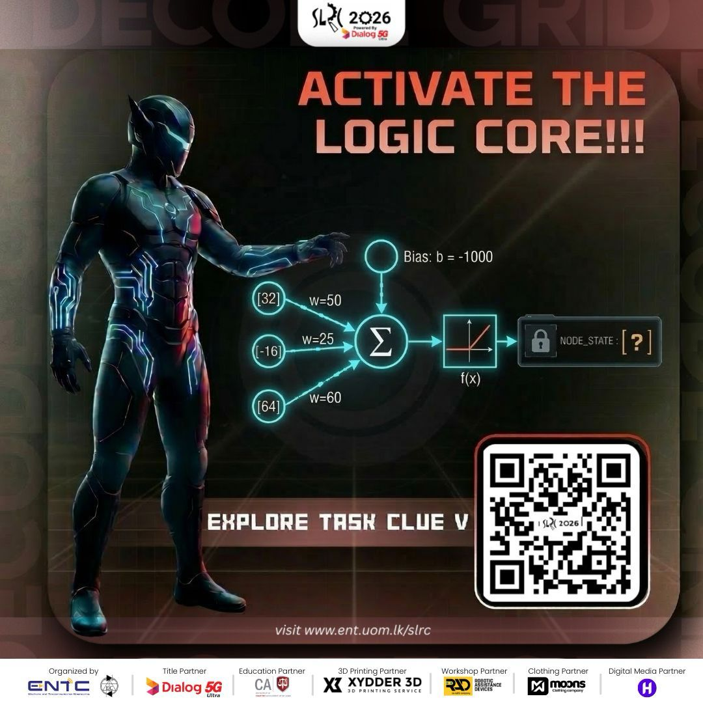

# Clue 5: Key 4 Decoder Guide



This clue uses:

- Key ID: `4`
- Key `(K)`: `Solve the Puzzle to find the Key!!!`
- Decryption Algorithm
    1. The scanned AprilTag value is a 5-digit number of the form `kabcd`.
    2. The first digit `k` is the key ID.
    3. The remaining 4 digits form the payload `P = abcd`.
    4. `G` is the Gray code of the payload. ie. `G = P XOR floor(P / 2)`
    5. `A = G XOR K`

- Then convert `A` into coordinates:

```text
order = floor(A / 625) + 1
remainder = A % 625
x = floor(remainder / 25)
y = remainder % 25
```

- Valid coordinate output range:

    - `order`: 1 to 14
    - `x`: 0 to 24
    - `y`: 0 to 24

## Worked Example 1

- Tag: `42305`
- Key ID: `4`
- Payload: `2305`
- AprilTag image:

- Final decoded result `(OOXXYY)` : `012310`

## Worked Example 2

- Tag: `46258`
- Key ID: `4`
- Payload: `6258`
- AprilTag image:

- Final decoded result `(OOXXYY)` : `120618`
