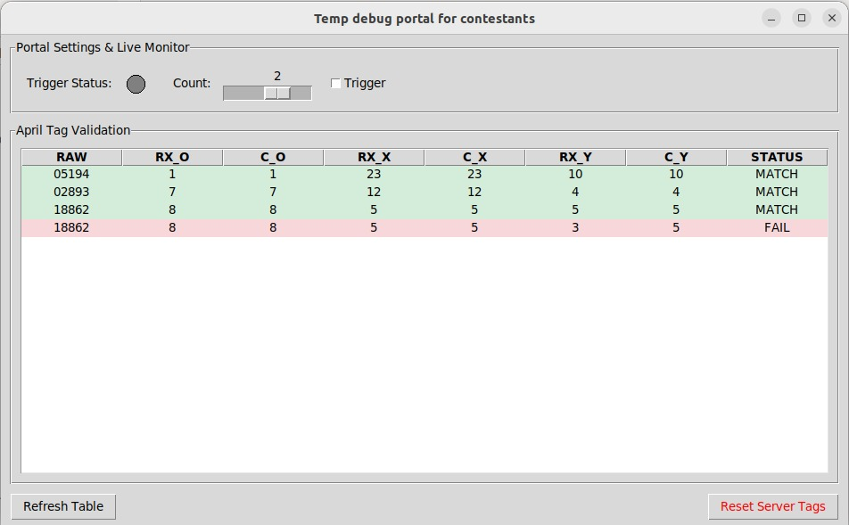

# Temp Debug Portal: User Manual

## Overview
The **Temp Debug Portal** is a contestant-side software utility designed to validate robot simulation parameters and verify real-time communication with the competition server. It ensures that the physical robot's decoded AprilTag data matches the server's expected values before the final mission completion.

---

## 1. Portal Settings & Live Monitor
This section allows teams to simulate the final phase of the mission and monitor server feedback.

* **Trigger (Checkbox):** This acts as the manual trigger simulation for the activation of the portal in the real-world arena.
* **Count:** Specifies the number of boxes currently present in the portal or transparent tube area.
* **Trigger Status:** Provides real-time feedback from the server regarding the activation state of the bridge or portal.

---

## 2. April Tag Validation Table
As the physical robot detects and decodes AprilTags during Task 1 and Task 2, the data is transmitted to the server. This table compares received data against the ground truth for the 14 required coordinate points.

| Column | Description |
| :--- | :--- |
| **RAW** | The raw, obfuscated AprilTag ID value detected by the robot (Range: 0–48713). |
| **RX_O** | **Order ID Received:** The sequence index currently sent by the robot. |
| **C_O** | **Order ID Correct:** The expected sequence index for Ares (Valid range: 1–14). |
| **RX_X** | **X-Axis Received:** The Cartesian X-coordinate sent to the server. |
| **C_X** | **X-Axis Correct:** The expected X-coordinate cell in the 25x25 grid. |
| **RX_Y** | **Y-Axis Received:** The Cartesian Y-coordinate sent to the server. |
| **C_Y** | **Y-Axis Correct:** The expected Y-coordinate cell in the 25x25 grid. |
| **STATUS** | Displays **MATCH** if values align, or **FAIL** if there is a decoding or transmission error. |

---

## 3. Control Actions

* **Refresh Table:** Manually pulls the latest detected AprilTag data from the server to update the validation list.
* **Reset Server Tags:** Clears all currently cached tags on the server side. Use this to clear data between different test runs to ensure a clean validation state.

---

## Technical Specifications
* **Tag Family:** All AprilTags used in the competition belong to the **tagStandard52h13** family.
* **Tag Dimensions:** Physical tags measure 6 cm x 6 cm.
* **Grid Size:** The simulation environment consists of a 25x25 grid with 40 cm x 40 cm cells.
* **Decoding:** Payload digits must be processed using one of the 5 predefined keys obtained from pre-competition challenges.
