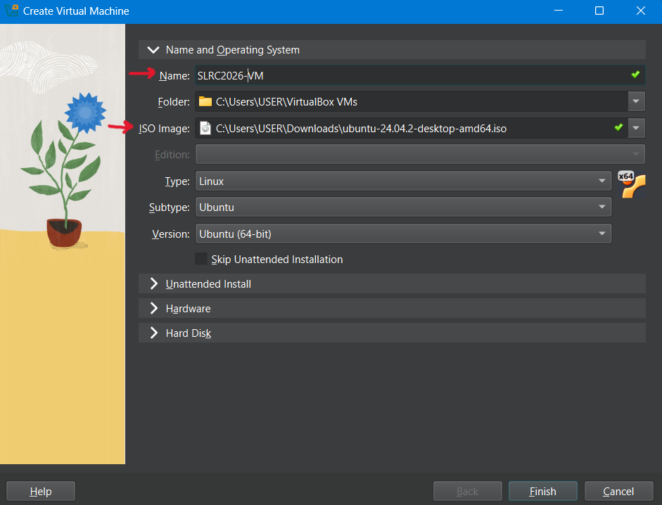
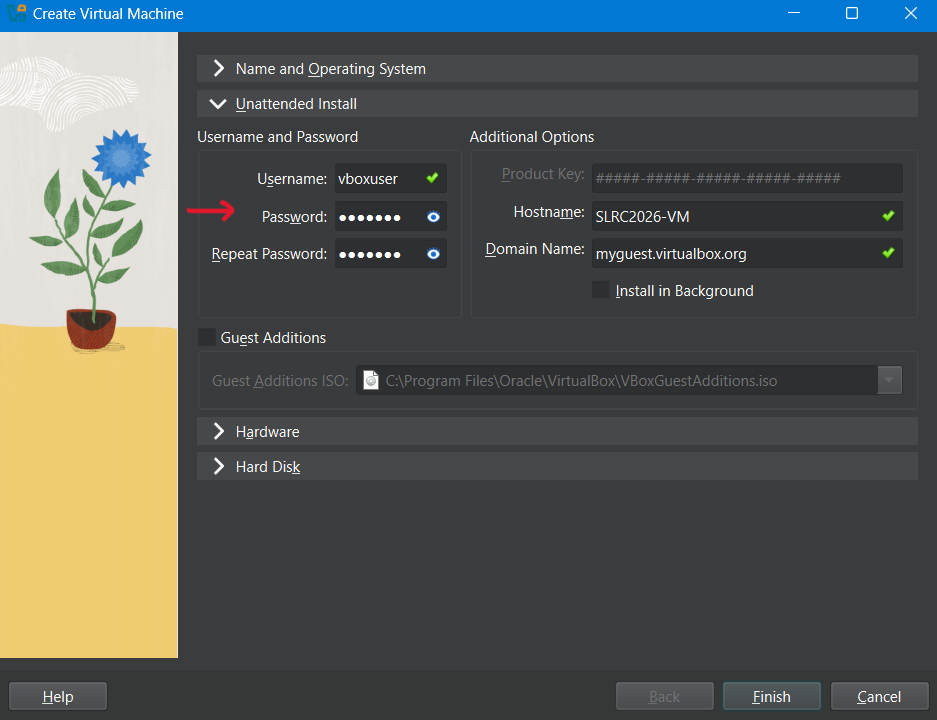
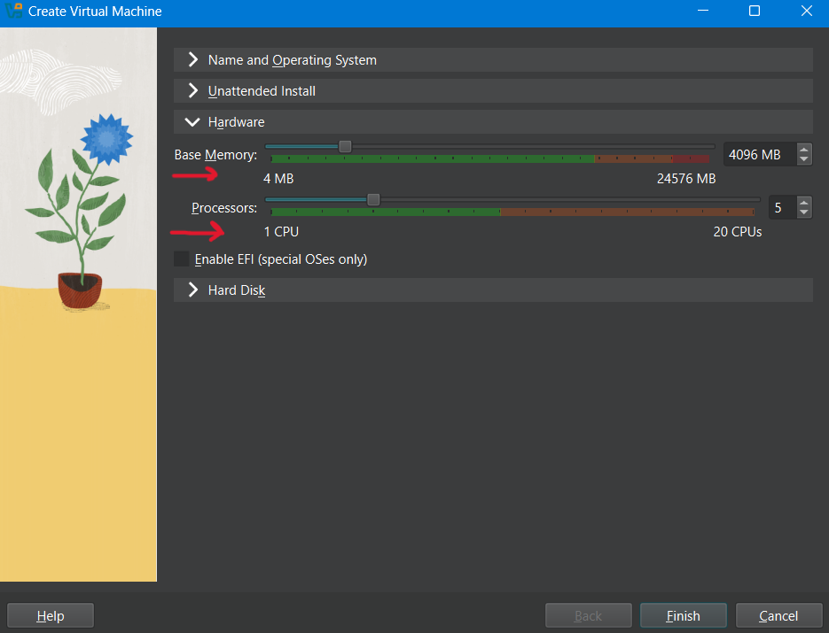

# SLRC 2026 Simulation

Tron-style arena simulation (Gazebo) with two robots: **Ares** (red, your team robot) and **Hostile** (green, autonomous). You control Ares only, via a REST API, from your Raspberry Pi or PC. The Hostile robot follows the yellow line on its own.

---

## Requirements

### OS
- **Option 1:** Ubuntu 22.04. Other Ubuntu versions or other Linux distros may work but not guaranteed.

- **Option 2:** Windows (Using a Virtual Machine)
  Windows is supported via a virtual machine. The setup has been tested with Oracle VirtualBox running Ubuntu 22.04.2 .

    #### 1. Install VirtualBox
    Download and install Oracle VirtualBox.
    
    #### 2. Create a New Virtual Machine
    Click **New** in VirtualBox to create a new VM.
    
    #### 3. Configure Name and Operating System
    - Enter a suitable VM name.
    - Under **Name and Operating System**, mount the Ubuntu `.iso` file (tested with Ubuntu 22.04.2).
    - Download the Ubuntu ISO from:  
      https://ubuntu.com/download/desktop
    
      
    
    #### 4. Unattended Installation
    - Under **Unattended Install**, set a secure username and password.
      
      
    
    #### 5. Hardware Configuration
    - Allocate sufficient RAM and CPU cores according to your host machine specifications.
    - Recommended minimum:
      - 4 GB RAM
      - 2 CPU cores  
      (Higher allocation is recommended for better simulation performance.)
    
    
    
    ####  6. Build
    - Now follows the below steps to clone the repo and build the simulation. (*Alternative*: Install the repo as a zip file, navigate to the directory and build by following step 2 onwards.) 


---

## Setup (3 steps)

### 1. Clone

```bash
cd ~
git clone https://github.com/SLRC-official/slrc_sim_2026 slrc_ws
cd slrc_ws
```

This downloads the simulation files. You only need to do this once.

### 2. Build

```bash
./scripts/build_container.sh
```

This creates a Python virtual env (`slrc`), installs dependencies from `requirements.txt`, and builds a Docker image with ROS 2, Gazebo, the bridge, and the API. It may take several minutes the first time. You only need to rebuild if you change the simulation or update the repo.

### 3. Run

```bash
./scripts/run_container.sh
```

This starts the simulation. The run script automatically sets up display access for Gazebo, so you don't need to run `xhost` manually. A Gazebo window should open showing the arena and two robots: **Ares** (red, your robot) and **Hostile** (green). Leave this terminal open.

In the logs, wait until you see:
```
Uvicorn running on http://0.0.0.0:8000
```
That means the API is ready. You can now send commands to Ares from another terminal or from your Raspberry Pi. 

**Note:** The "Uvicorn running..." message may not be the final log line printed. Additional ROS logs or runtime messages may appear afterward. If unsure, scroll through the console output and verify that the Uvicorn startup line is present.

---

**Hostile robot (local testing only):** The Hostile robot (green) will sit still until you start its controller. In a *separate* terminal:
```bash
cd slrc_ws
source slrc/bin/activate
python utils/hostile_controller.py
```
The Hostile will then follow the yellow line. On competition day, organizers run this; you do not.

## Testing the API

Run a short test (drive, rotate, read odometry) to confirm the API is working:

```bash
cd slrc_ws
source slrc/bin/activate
python examples/test_api.py
```

> **Tip:** Defaults use `http://0.0.0.0:8000`, which matches the API listening on all interfaces. From another device on the LAN you can instead use the simulation PC’s address, e.g. `http://192.168.1.53:8000`, set `BASE_URL` or `SLRC_API_URL` accordingly.

---

## Viewing Camera Feeds

To display Ares camera feeds (`front_left`, `front_right`, `floor`) in OpenCV windows:

```bash
cd slrc_ws
source slrc/bin/activate
python examples/view_cameras.py
```

Press `q` to quit.

---

## API Base URL

| Scenario | URL |
|---|---|
| Sim and client on the **same machine** | `http://0.0.0.0:8000` (API binds `0.0.0.0`; clients may also use the host’s LAN IP) |
| Client on a **different device**, same LAN | `http://<SIM_PC_IP>:8000` |
| **Competition day** (organizer-hosted sim) | `http://<SIMULATION_HOST_IP>:8000` *(provided by organizers)* |

---

## Connecting from a Raspberry Pi (or any SBC)

### Example: Health Check

```python
import requests

API_BASE = "http://0.0.0.0:8000"  # On another machine, use http://<SIM_PC_IP>:8000

def check_api():
    try:
        r = requests.get(f"{API_BASE}/health", timeout=2)
        if r.status_code == 200:
            data = r.json()
            print("API ready.")
            print("  Odometry available:", data.get("odom_available"))
            print("  Cameras:", data.get("cameras"))
            return True
    except requests.RequestException as e:
        print("API not reachable:", e)
    return False
```

### 2. Set velocity (differential drive)

```python
def set_velocity(velocity, omega):
    """velocity: m/s (positive=forward), omega: rad/s (positive=CCW)"""
    try:
        r = requests.post(f"{API_BASE}/set_velocity", json={"velocity": velocity, "omega": omega}, timeout=1)
        return r.status_code == 200
    except requests.RequestException:
        return False

# Example: drive forward at 0.5 m/s
set_velocity(0.5, 0.0)

# Example: turn in place (CCW at 1 rad/s)
set_velocity(0.0, 1.0)

# Example: stop
set_velocity(0.0, 0.0)
```

### 3. Emergency stop

```python
def stop():
    try:
        requests.post(f"{API_BASE}/stop", json={}, timeout=1)
    except requests.RequestException:
        pass
```

### 4. Move relative (forward/rotate with smooth profile)

```python
def move_relative(distance, rotation):
    """distance: meters (positive=forward), rotation: radians (positive=CCW)"""
    try:
        r = requests.post(f"{API_BASE}/move_relative", json={"distance": distance, "rotation": rotation}, timeout=1)
        return r.status_code == 200
    except requests.RequestException:
        return False

# Example: drive forward 1 meter
move_relative(1.0, 0.0)

# Example: rotate 90° counter-clockwise
import math
move_relative(0.0, math.pi / 2)
```

### 5. Get odometry (pose and velocity)

```python
def get_odometry():
    try:
        r = requests.get(f"{API_BASE}/odometry", timeout=2)
        if r.status_code == 200:
            data = r.json()
            x = data["pose"]["x"]
            y = data["pose"]["y"]
            yaw = data["pose"]["yaw"]
            return x, y, yaw
    except (requests.RequestException, KeyError):
        pass
    return None

# Example usage
pose = get_odometry()
if pose:
    x, y, yaw = pose
    print(f"Position: x={x:.2f} y={y:.2f} yaw={yaw:.2f}")
```

### 6. Get arena metadata (start, portal cells, grid)

```python
def get_arena_metadata():
    try:
        r = requests.get(f"{API_BASE}/arena/metadata", timeout=2)
        if r.status_code == 200:
            return r.json()
    except requests.RequestException:
        pass
    return None

# Example usage
meta = get_arena_metadata()
if meta:
    start = meta["start_cell"]      # [2, 24]
    portal = meta["portal_cell"]    # [20, 3]
    cell_size = meta["cell_size"]   # 0.4
    grid_span = meta["grid_span"]   # 10.0
```

### 7. Get camera frame (JPEG)

```python
def get_camera_frame(cam_id):
    """cam_id: 'front_left', 'front_right', or 'floor'"""
    try:
        r = requests.get(f"{API_BASE}/camera/{cam_id}/frame", timeout=2)
        if r.status_code == 200:
            return r.content  # raw JPEG bytes
    except requests.RequestException:
        pass
    return None

# Example: process floor camera with OpenCV
import cv2
import numpy as np

frame_bytes = get_camera_frame("floor")
if frame_bytes:
    arr = np.frombuffer(frame_bytes, dtype=np.uint8)
    img = cv2.imdecode(arr, cv2.IMREAD_COLOR)
    # Use img for line detection, etc.
```

### Minimal working example (copy and run)

This script waits for the API, drives forward, stops, prints the pose, then rotates 180°. Run it once the simulation is up and you see "Uvicorn running":

```python
import requests
import time
import math

API_BASE = "http://0.0.0.0:8000"

# Wait for API
while True:
    try:
        if requests.get(f"{API_BASE}/health", timeout=2).status_code == 200:
            break
    except requests.RequestException:
        pass
    time.sleep(1)
print("API ready")

# Drive forward 0.5 m
requests.post(f"{API_BASE}/set_velocity", json={"velocity": 0.5, "omega": 0.0})
time.sleep(2)
requests.post(f"{API_BASE}/stop")

# Get pose
r = requests.get(f"{API_BASE}/odometry")
if r.status_code == 200:
    d = r.json()
    print(f"Pose: x={d['pose']['x']:.2f} y={d['pose']['y']:.2f} yaw={d['pose']['yaw']:.2f}")

# Rotate 180°
requests.post(f"{API_BASE}/move_relative", json={"distance": 0, "rotation": math.pi})
```

---

## Sensor Specifications (Ares)

All sensor positions are relative to `base_link`.

### IMU

| Parameter | Value |
|-----------|-------|
| Frame | `imu_link` |
| Position (x, y, z) | `0, 0, 0.05` m (centered on chassis, 5 cm above base) |
| Topic | `/ares/imu/data` |
| Update rate | 100 Hz |
| Angular velocity noise | Gaussian, stddev = 0.001 rad/s |
| Linear acceleration noise | Gaussian, stddev = 0.01 m/s² |

### Cameras

| Parameter | Front Left | Front Right | Floor |
|-----------|-----------|------------|-------|
| Frame | `cam_front_left_link` | `cam_front_right_link` | `cam_floor_link` |
| Position (x, y, z) | `0.45, 0.10, 0.45` m | `0.45, -0.10, 0.45` m | `0.15, 0.0, 0.18` m |
| Orientation (r, p, y) | `0, 0, 0.7854` rad (yaw +45°) | `0, 0, -0.7854` rad (yaw −45°) | `0, 1.5708, 0` rad (pitch 90° down) |
| Resolution | 640 × 480 | 640 × 480 | 640 × 480 |
| Horizontal FOV | 1.658 rad (~95°) | 1.658 rad (~95°) | 2.268 rad (~130°) |
| Clip range | 0.05 – 50 m | 0.05 – 50 m | 0.02 – 10 m |
| Format | R8G8B8 | R8G8B8 | R8G8B8 |
| Update rate | 30 Hz | 30 Hz | 30 Hz |
| Image topic | `/ares/front_left/image_raw` | `/ares/front_right/image_raw` | `/ares/floor/image_raw` |
| Info topic | `/ares/front_left/camera_info` | `/ares/front_right/camera_info` | `/ares/floor/camera_info` |

### LED

| Parameter | Value |
|-----------|-------|
| Base frame | `led_base_link` |
| Dome frame | `led_link` |
| Base position (x, y, z) | `-0.05, 0, 0.058` m (rear of chassis, top) |
| Dome position | `0, 0, 0.015` m above base (mounted on top) |
| Geometry | Cylinder base (r=0.005, h=0.015) + sphere dome (r=0.008) |
| Default state | Off (0) — dome is dark gray; turns bright blue when on |
| Gazebo Sim note | This stack uses **Ignition Fortress** (Gazebo Sim 6), not Gazebo Classic. There is **no** `libLedPlugin.so` — the dome uses `visual_config` and an SDF **point light** (`led_point`) uses `light_config`, both via the built-in UserCommands plugin. The Docker image installs `ignition-tools` so `ign service` works. **Entity names:** `ign sdf -p` merges fixed joints into `base_footprint`, so the API targets `ares::base_footprint::base_footprint_fixed_joint_lump__led_dome_vis_visual_2` and `ares::base_footprint::led_point`, not `led_link`. |

---

## API Reference (Ares – Contestant Access)

**Base URL:** `http://0.0.0.0:8000` by default (server listens on all interfaces; from another host use `http://<SIMULATION_HOST_IP>:8000`)

Units: `velocity` (m/s), `omega` (rad/s), `distance` (m), `rotation` (rad).

**Important:** Only the endpoints listed below will be available to contestants at the final competition. Any other endpoint you might see locally (e.g. during development) will **not** be exposed at the competition. Those are reserved for organizers (score keeping, collision detection, utility management, etc.). Do not rely on them in your code.

### Health & Info

| Method | Path | Description |
|--------|------|-------------|
| GET | `/` | Status, robot name, API version |
| GET | `/health` | Detailed health (odom, cameras) |

### Motion Control

| Method | Path | Payload | Description |
|--------|------|---------|-------------|
| POST | `/set_velocity` | `{"velocity": float, "omega": float}` | Set differential drive velocity. Positive velocity = forward, positive omega = counter-clockwise. |
| POST | `/stop` | `{}` | Emergency stop |
| POST | `/move_relative` | `{"distance": float, "rotation": float}` | Execute relative move with trapezoidal profile. Blocks until done. |

### Sensors

| Method | Path | Response |
|--------|------|----------|
| GET | `/odometry` | `{pose: {x, y, z, yaw, orientation}, velocity: {linear, angular}}` |
| GET | `/imu` | `{angular_velocity: {x,y,z}, linear_acceleration: {x,y,z}}` |
| GET | `/camera/{cam_id}/frame` | JPEG image |
| GET | `/camera/{cam_id}/stream` | MJPEG stream |
| GET | `/led` | `{led: 0\|1}` — current LED state |
| POST | `/led` | `{"state": 1}` or `{"state": 0}` — turn LED on/off |

**Camera IDs:** `front_left`, `front_right`, `floor`

### Arena

| Method | Path | Description |
|--------|------|-------------|
| GET | `/arena/metadata` | Grid size, cell size, start/portal cells, world coords |
| GET | `/start_coordinate` | `{x, y}` Ares start in world frame |

### Utility

| Method | Path | Payload | Description |
|--------|------|---------|-------------|
| POST | `/utility/set_led` | `{"state": "on"\|"off"\|"blink", "color": "red"\|"blue"\|"green"}` | LED control |
| POST | `/utility/mark_path` | `{"points": [[x,y],[x,y],...], "type": "polyline"}` | Draw path marker (debug) |

### Portal & AprilTag (competition / finals; Ares port 8000)

These routes provide HTTP access for **portal configuration** (box count, trigger) and for **staging AprilTag** reports from probes or vision. They are always enabled on each API process. State is in-memory **per process**—use port **8000** (Ares) for team robot control and for portal/tag traffic in normal operation; the Hostile API on **8001** exposes the same paths but maintains a separate cache.

**Contestants:** Tag readings use a five-character `raw` string plus `order` (sequence 1–14) and grid coordinates `x`, `y` (0–24). Submit with `POST /april_tag`. Read portal state with `GET /get_num_boxes_portal` (`count` and `trigger`).

**Organizers / operators:** Portal endpoints support the control UI (`/set_num_boxes_portal` with JSON `count` and `trigger`; `/set_num_boxes_portal_esp` sets `trigger` only, e.g. for external hardware). AprilTag history: `GET /get_april_tag`; clear cache with `POST /reset_april_tag` and `{"pass": "slrc_is_the_best"}`. The optional Tk GUI decodes `raw` locally and validates against reported `order`, `x`, `y` (published key-ID formulas: reverse digits, nibble swap, complement, digit swap, Gray code, then map index `A` to `order`, row, column).

| Method | Path | Payload / response | Description |
|--------|------|--------------------|-------------|
| GET | `/get_num_boxes_portal` | `{"count": int, "trigger": bool}` | Current portal settings |
| POST | `/set_num_boxes_portal` | `{"count": optional int, "trigger": optional bool}` | Update portal from GUI or automation |
| POST | `/set_num_boxes_portal_esp` | `{"trigger": bool}` | Set trigger only (e.g. ESP) |
| POST | `/april_tag` | `{"raw": string, "order": int, "x": int, "y": int}` | Append one tag report |
| GET | `/get_april_tag` | `{"data": [ ... ]}` | All cached tag reports |
| POST | `/reset_april_tag` | `{"pass": "slrc_is_the_best"}` | Clear tag cache (`401` if wrong password) |

**Example (Python):** See [examples/test_portal_apriltag_api.py](examples/test_portal_apriltag_api.py) — waits for `/health`, reads portal `count` and `trigger` via `GET /get_num_boxes_portal`, posts sample readings with `POST /april_tag`, then lists `GET /get_april_tag`. Minimal pattern:

```python
import requests

API = "http://0.0.0.0:8000"  # from another device use http://<SIM_PC_IP>:8000

# Box count (and trigger) from portal
r = requests.get(f"{API}/get_num_boxes_portal", timeout=3)
r.raise_for_status()
portal = r.json()
print("count:", portal["count"], "trigger:", portal["trigger"])

# Submit one AprilTag reading
requests.post(
    f"{API}/april_tag",
    json={"raw": "05194", "order": 1, "x": 23, "y": 10},
    timeout=3,
).raise_for_status()
```

---

## Example Scripts

Activate the env first: `source slrc/bin/activate`

| Script | Description | Run |
|--------|-------------|-----|
| [examples/test_api.py](examples/test_api.py) | Test Ares API (velocity, odom, move_relative) | `python examples/test_api.py` |
| [examples/test_portal_apriltag_api.py](examples/test_portal_apriltag_api.py) | Portal & AprilTag API sample (`/get_num_boxes_portal`, `/april_tag`) | `python examples/test_portal_apriltag_api.py` |
| [examples/view_cameras.py](examples/view_cameras.py) | View Ares camera feeds in OpenCV windows | `python examples/view_cameras.py` |
| [utils/hostile_controller.py](utils/hostile_controller.py) | Hostile line follower (organizer; run for local testing) | `python utils/hostile_controller.py` |
| [src/slrc_sim_bridge/slrc_sim_bridge/utils/portal_apriltag_gui.py](src/slrc_sim_bridge/slrc_sim_bridge/utils/portal_apriltag_gui.py) | Portal + AprilTag monitor (Tk; needs `DISPLAY`, `python3-tk`) | `ros2 run slrc_sim_bridge portal_apriltag_gui` (optional `--api-url http://0.0.0.0:8000`) |

The Docker full stack starts this GUI by default (`container_full.launch.py` sets `SLRC_API_URL` to `http://0.0.0.0:8000`). Set launch argument `launch_portal_gui:=false` to disable it. Override the API URL with env `SLRC_API_URL` if needed.

---

## World Generation

If you want to change the arena (grid, yellow path, obstacles), you can generate a new world file:

1. Edit `src/slrc_tron_sim/worlds/worldgen.py` to change the path nodes, grid size, etc.
2. Run: `cd src && python3 slrc_tron_sim/worlds/worldgen.py`  
   This creates/overwrites `encom_grid.sdf` in the same folder.
3. To use a different world file: generate it, rename it to `encom_grid.sdf`, and put it in `src/slrc_tron_sim/worlds/`, replacing the existing one.
4. Rebuild the image and run: `./scripts/build_container.sh` then `./scripts/run_container.sh`.

**Important:** Do not modify `arena_config.yaml`, `bridge.yaml`, or the launch files. The competition uses the exact configurations from this repo.

---

## Troubleshooting

| Problem | Solution |
|---------|----------|
| No Gazebo window | The run script runs `xhost +local:docker` for you. If the window still doesn't appear, open a new terminal, run `xhost +local:docker` once, then run `./scripts/run_container.sh` again. On Wayland, you may need an X server (e.g. Xwayland). |
| "Permission denied" on scripts | Run `chmod +x scripts/*.sh` in the slrc_ws folder. |
| Connection refused to API | The API starts inside the container. Wait for the line `Uvicorn running on http://0.0.0.0:8000` in the container logs. If you changed the run command or network, undo it—the script uses host network so API is on localhost. |
| Cameras return 503 | The simulation needs a few seconds to load. Wait ~10 s after the robots appear in Gazebo. |
| Robots don't move | Don't change launch or network config. Check the container terminal for errors. |
| Not Ubuntu 22 | This simulation is tested only on Ubuntu 22.04. Other versions may fail. |

---

## Quick Reference

| Step | Command |
|------|---------|
| Build | `./scripts/build_container.sh` |
| Run | `./scripts/run_container.sh` |
| Activate env | `source slrc/bin/activate` |
| Test API | `python examples/test_api.py` |
| Test portal & AprilTag API | `python examples/test_portal_apriltag_api.py` |
| View cameras | `python examples/view_cameras.py` |
| Hostile controller (local test) | `python utils/hostile_controller.py` |
| Generate world | `cd src && python3 slrc_tron_sim/worlds/worldgen.py` |
