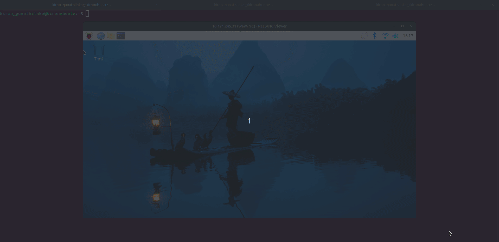

<!DOCTYPE html>
<html lang="en">
<head>
    <meta charset="UTF-8">
    <meta name="viewport" content="width=device-width, initial-scale=1.0">
    <title>Wi-Fi Connection Guide (nmcli)</title>
    
</head>
<body>

    <h1>📶 Connecting to a Wi-Fi Network Using <code>nmcli</code></h1>
    
Follow the steps below to connect to a Wi-Fi network from the terminal.

    <h2>1. Check Available Networks</h2>
    
Scan and verify that your desired network is available:

    <pre><code>nmcli device wifi list</code></pre>
    <h2>2. Connect to the Network</h2>
    
Once you confirm the network is listed, connect using:

    <pre><code>sudo nmcli device wifi connect "SLRC_5G" password "SLRC@2026"</code></pre>
    <h2>🎥 Demo</h2>
    
Refer to the GIF below for a step-by-step visual guide:

    

        <!-- Replace the file name below with your actual GIF -->
        
    

    <footer>
    </footer>

</body>
</html>